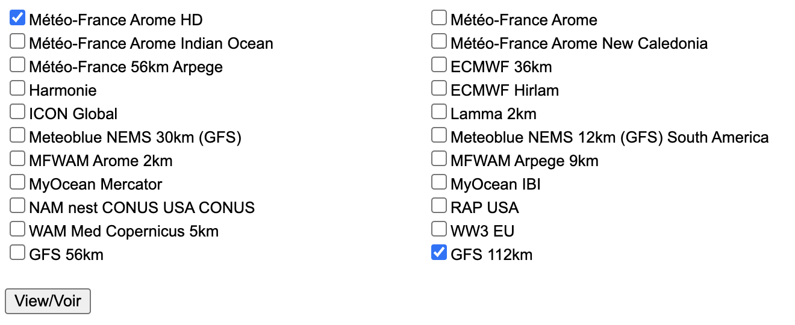
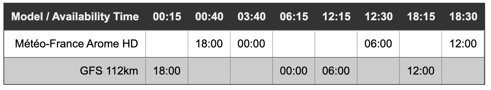

# Squid (Great Circle) - Weather Models Availability Times - Heures de disponibilité des modèles météo</h3>

Cet outil présente la disponibilité des modèles météo au cours de la journée plutôt que selon l'heure des données du modèle.

This tool presents the weather models availability times across the day, rather than per model data time.

## Example - Exemple

With this selection - Avec cette sélection :

You get this table - Vous obtenez cette table :

Source data = [squid-sailing.com/en/content/12-runtimes-24h](https://www.squid-sailing.com/en/content/12-runtimes-24h)

Hosted as a free [Heroku](https://heroku.com) dyno
